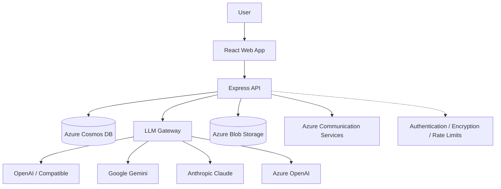

# XPIA Tools

**Open-source AI security toolkit for testing indirect prompt injection / cross-prompt injection (XPIA).**

Generate realistic adversarial documents, images, web pages, QR codes, and prompt payloads to evaluate how AI systems respond to malicious instructions embedded in untrusted content.

**Windows Desktop · CLI · Self-Hosted Web App · MIT Licensed**


[Download the latest Windows release](https://github.com/skajake1983/xpia-tools-oss/releases) · [CLI](cli/) · [Self-host](#self-host-the-web-app) · [Contribute](CONTRIBUTING.md)

---

## Why XPIA Tools?

AI systems increasingly consume content they did not create: documents, web pages, images, retrieved knowledge, messages, structured data, and other external content.

That creates an important security boundary.

An attacker may place instructions inside that content and attempt to influence an AI system when the content is later processed. This class of attack is commonly referred to as **indirect prompt injection**, **cross-prompt injection**, or **XPIA**.

Testing these scenarios manually is slow and difficult to reproduce.

**XPIA Tools makes it easier to create, vary, and reproduce adversarial test artifacts for authorized AI security research.**

Use it to:

* Generate documents containing XPIA techniques
* Create adversarial images and multimodal test content
* Produce prompt-injection payload variations
* Build and host test web pages
* Embed techniques in QR codes and structured files
* Turn existing XPIA examples into new variations
* Exercise AI systems repeatedly with consistent test artifacts
* Build reusable XPIA evaluation sets and regression tests

> ⚠️ **Responsible use only**
>
> XPIA Tools is intended for security research and testing of AI/LLM systems that you own or are explicitly authorized to evaluate.
>
> Do not use this project to target systems without authorization. See [SECURITY.md](SECURITY.md).

---

## See the Workflow

A typical XPIA evaluation looks like this:

```text
Choose an XPIA technique
        ↓
Select an artifact type
        ↓
Generate adversarial content
        ↓
Provide it to the AI system under test
        ↓
Observe whether the embedded instruction influences behavior
        ↓
Modify / vary the attack
        ↓
Retest defenses
```

XPIA Tools focuses on the **adversarial-content side of the evaluation**: creating realistic input artifacts that can be used to test whether an AI system correctly handles untrusted instructions.

---

# Get Started

There are three ways to use XPIA Tools.

| Option                  | Best for                                                 | Infrastructure    |
| ----------------------- | -------------------------------------------------------- | ----------------- |
| **Windows Desktop**     | Security researchers who want to start immediately       | None              |
| **CLI**                 | Automation, scripting, datasets, CI/CD, batch generation | Local Node.js     |
| **Self-Hosted Web App** | Teams, shared environments, administration, metrics      | Azure / Cosmos DB |

---

## Windows Desktop

**The fastest way to use XPIA Tools.**

The standalone Windows application runs locally and does not require an XPIA Tools account or server.

1. Go to [Releases](https://github.com/skajake1983/xpia-tools-oss/releases)
2. Download the latest `XPIA-Tools-Setup-<version>.exe`
3. Install XPIA Tools
4. Choose an LLM provider
5. Add your API key
6. Start generating XPIA test artifacts

Your provider configuration, models, API keys, prompt customizations, history, and generated pages persist locally.

API keys are encrypted at rest using an OS-backed encryption key.

### Automatic Updates

The desktop application checks GitHub Releases for updates automatically and can install newer versions without requiring you to manually download every release.

### Windows SmartScreen

The current Windows installer is unsigned.

On first installation, Windows SmartScreen may display an **Unknown publisher** warning. Review the release and source code before installing software from GitHub, then use **More info → Run anyway** if you choose to proceed.

---

# What Can XPIA Tools Generate?

## Documents

Generate realistic files containing embedded XPIA techniques.

Supported formats include:

* DOCX
* PDF
* PPTX
* XLSX
* HTML
* CSV
* Markdown
* RTF
* ICS
* VCF
* JSON
* YAML

Different formats allow researchers to evaluate how AI systems behave when adversarial instructions arrive through different content and ingestion paths.

---

## Images

Generate adversarial visual content in:

* PNG
* JPG
* WebP
* GIF
* SVG

Available visual layouts include:

* Dashboard
* Report
* Infographic
* Email preview
* Timeline
* Comparison

Images can also incorporate QR codes and LLM-generated contextual content.

---

## QR Codes

Generate QR codes containing or pointing to XPIA test content.

QR-based scenarios are useful when evaluating multimodal AI systems and workflows capable of detecting, decoding, or following content represented visually.

---

## Prompt-Injection Payloads

Generate targeted XPIA payloads across different categories and severity levels.

Payload generation supports:

* Technique selection
* Category selection
* Severity
* Evasion modifiers
* JSON output
* Text output
* Batch generation

Payloads can be used directly or embedded inside other artifacts.

---

## Web Pages

Generate realistic web pages containing XPIA test content.

Depending on how you run XPIA Tools, generated pages can be:

* Previewed locally
* Exported as HTML
* Hosted on infrastructure you control
* Served through the desktop application's optional read-only LAN listener
* Published through Azure Blob Storage in a self-hosted deployment

The desktop LAN listener is opt-in and disabled by default. It exposes generated page content only; application administration, API keys, and generation endpoints remain bound locally.

---

# Vary an Existing XPIA Example

Already have a real test artifact?

XPIA Tools can use an existing example as the starting point for additional research.

Upload:

* DOCX
* PDF
* RTF
* TXT
* Markdown

Or paste an existing payload.

XPIA Tools can use your selected model to identify the embedded technique and generate variations across dimensions such as:

* Rewording
* Re-embedding
* Retargeting

This makes it easier to test whether a defense is robust against a **class of attacks** rather than a single static payload.

Content is only sent to the configured model provider after explicit consent.

---

# Supported LLM Providers

XPIA Tools uses a pluggable provider architecture.

The web and desktop experiences support:

* OpenAI
* OpenAI-compatible endpoints
* Google Gemini
* Anthropic Claude
* Azure OpenAI

The CLI additionally supports configurations for:

* xAI
* OpenRouter
* Ollama
* LM Studio
* Azure AI Foundry-compatible endpoints

Local providers such as Ollama and LM Studio can be used without an API key.

LLM enhancement is optional for CLI workflows that do not require model-generated content.

---

# CLI

Prefer a terminal or need repeatable batch generation?

The `cli/` package runs locally without Azure or Cosmos DB and uses the same core generation engine.

## Install

```bash
cd cli
npm install
```

Run commands through:

```bash
npm run dev -- <command> [options]
```

## Generate a Document

```bash
npm run dev -- generate \
  --type docx \
  --technique di-ignore-previous \
  --out ./out
```

## Generate Multiple Images

```bash
npm run dev -- generate \
  --type png \
  --technique mm-tiny-font \
  --layout timeline \
  --qr \
  --count 5 \
  --out ./out
```

## Generate Payloads

```bash
npm run dev -- payloads \
  --count 10 \
  --format text \
  --out ./out
```

## Explore Available Techniques

```bash
npm run dev -- list techniques
```

Other discovery commands include:

```text
types
layouts
categories
evasions
```

## Add an LLM Provider

For example:

```bash
npm run dev -- providers add openai
```

Then provide the API key through the appropriate environment variable and specify a model when generating content.

CLI API keys are provided through environment variables and are not written to disk.

See [cli/README.md](cli/README.md) for the complete CLI reference.

---

# Self-Host the Web App

XPIA Tools also includes a multi-user web application for teams that want centralized administration, provider configuration, metrics, and shared infrastructure.

## Web Application Features

The hosted version includes:

* Document generation
* Image generation
* Payload generation
* Web-page generation and hosting
* Multi-provider LLM gateway
* Per-user API key management
* Provider/model configuration
* Model import from supported providers
* Custom prompt templates
* User and role management
* Invite codes
* Usage metrics
* Audit logging
* Maintenance mode
* Two-factor authentication

---

## Prerequisites

For local web development:

* Node.js 22
* Azure Cosmos DB Emulator or Azure Cosmos DB
* At least one supported LLM provider if using LLM-enhanced generation

---

## Install

Clone the repository and install dependencies:

```bash
npm run install:all
```

Create:

```text
server/.env
```

Example configuration:

```env
# Required in production
JWT_SECRET=<64-char-hex>
JWT_REFRESH_SECRET=<64-char-hex>
ENCRYPTION_KEY=<64-char-hex>

# Cosmos DB
COSMOS_ENDPOINT=https://localhost:8081
COSMOS_KEY=<emulator-key>
COSMOS_DATABASE=xpia-tools

# Optional
CLIENT_URL=http://localhost:5173
PORT=3001
PUBLIC_PAGES_DOMAIN=<your-pages-domain>
AZURE_STORAGE_CONNECTION_STRING=<blob-storage-connection-string>
AZURE_COMMUNICATION_CONNECTION_STRING=<email-connection-string>
EMAIL_SENDER_ADDRESS=<sender-address>
GITHUB_TOKEN=<github-token>
GITHUB_REPO=<owner/repo>
```

---

## Run Locally

```bash
npm run dev
```

This starts:

```text
API server    http://localhost:3001
Web client    http://localhost:5173
```

On first startup, the server seeds the initial configuration and creates a bootstrap invite code when no users exist.

### First User

1. Copy the bootstrap invite code from the server logs
2. Open the registration page
3. Register using the invite code
4. Complete email verification
5. The first registered user is granted the admin role

---

# Architecture



The LLM gateway uses a provider/adapter architecture that normalizes requests and responses across supported providers.

In the hosted application, user API keys are encrypted using AES-256-GCM and decrypted only when needed for a request.

---

# Technology

| Layer          | Technology                           |
| -------------- | ------------------------------------ |
| Client         | React 19, Vite, TypeScript           |
| API            | Node.js 22, Express, TypeScript, Zod |
| Database       | Azure Cosmos DB                      |
| Storage        | Azure Blob Storage                   |
| Email          | Azure Communication Services         |
| Infrastructure | Azure App Service + Bicep            |
| Desktop        | Electron                             |
| CI/CD          | GitHub Actions                       |
| Testing        | Vitest                               |
| Edge / DNS     | Cloudflare-compatible                |

---

# Security

Security matters especially for a tool designed to generate adversarial AI content.

The hosted application includes:

* JWT access tokens
* HTTP-only refresh tokens
* TOTP two-factor authentication
* bcrypt password hashing
* AES-256-GCM API-key encryption
* Zod request validation
* Per-IP and per-user rate limiting
* Restricted CORS configuration
* Helmet security headers
* Administrative audit logging
* Token revocation / blocklisting
* Email verification
* Production secret validation

The desktop application uses a separate local-first security model and does not require hosted user authentication.

For vulnerability reporting and responsible-use guidance, see [SECURITY.md](SECURITY.md).

---

# Testing

XPIA Tools includes an automated test suite covering the server, client, and core application behavior.

Run all tests:

```bash
npm test
```

Server only:

```bash
cd server
npm test
```

Client only:

```bash
cd client
npm test
```

Coverage:

```bash
npm run test:coverage
```

The repository currently contains **500+ automated tests** across the application.

Pull requests to `main` run linting, builds, and automated tests through GitHub Actions.

---

# Deploy to Azure

Infrastructure-as-code templates are included under `infra/`.

Copy the example parameter file:

```bash
cp infra/main.parameters.example.json infra/main.parameters.json
```

Then deploy:

```bash
az deployment group create \
  --resource-group rg-xpia \
  --template-file infra/main.bicep \
  --parameters infra/main.parameters.json
```

The repository intentionally does not include automatic deployment into the original project infrastructure.

If you fork XPIA Tools, deploy it into infrastructure and accounts that you control.

---

# Fork and Self-Host

XPIA Tools is licensed under the MIT License.

You may:

* Fork it
* Modify it
* Rebrand it
* Self-host it
* Integrate portions into other projects
* Use it commercially subject to the license terms

To create your own deployment:

1. Fork the repository
2. Install the dependencies
3. Configure your environment
4. Update branding and metadata as desired
5. Configure your own domain
6. Deploy into your own Azure environment

Keep the required MIT copyright notice and applicable third-party license notices.

See [THIRD-PARTY-NOTICES.md](THIRD-PARTY-NOTICES.md).

---

# Project Structure

```text
xpia-tools-oss/
├── client/          # React web application
├── server/          # Express API + generation engine
├── desktop/         # Standalone Electron desktop application
├── cli/             # Local command-line generator
├── shared/          # Shared types
├── infra/           # Azure Bicep infrastructure
├── azure/           # Azure-related resources
├── static-pages/    # Static fallback pages
├── scripts/         # Build / deployment utilities
└── .github/         # GitHub Actions and repository automation
```

---

# Releases

XPIA Tools follows semantic versioning.

See:

* [Latest Release](https://github.com/skajake1983/xpia-tools-oss/releases/tag/v1.5.1)
* [All Releases](https://github.com/skajake1983/xpia-tools-oss/releases)
* [CHANGELOG.md](CHANGELOG.md)

The desktop application supports automatic updates from GitHub Releases.

---

# Contributing

Contributions are welcome.

Useful areas for contribution include:

* New XPIA techniques
* Additional artifact formats
* New adversarial layouts
* Evasion variants
* Provider integrations
* Test coverage
* Documentation
* Security research
* Bug fixes
* Reproducible XPIA test cases

If you discover an interesting indirect prompt-injection technique, consider contributing a reproducible implementation so other researchers can evaluate it consistently.

Before contributing, read:

* [CONTRIBUTING.md](CONTRIBUTING.md)
* [CODE_OF_CONDUCT.md](CODE_OF_CONDUCT.md)

For security vulnerabilities, follow [SECURITY.md](SECURITY.md) rather than opening a public issue.

---

# Research Philosophy

XPIA defenses should not be evaluated against one magic prompt.

Real systems encounter:

* Different formats
* Different wording
* Different visual presentations
* Different sources
* Different models
* Different tool chains
* Different levels of attacker control

XPIA Tools exists to make those variations easier to generate and reproduce.

The goal is not simply to answer:

> "Does this payload work?"

The more useful question is:

> **"How resilient is this AI system to classes of adversarial instructions delivered through untrusted content?"**

---

# License

XPIA Tools is released under the [MIT License](LICENSE).

The project also uses third-party components distributed under their respective licenses.

See [THIRD-PARTY-NOTICES.md](THIRD-PARTY-NOTICES.md).

---

# Author

Built and maintained by **Jacob Adams**.

XPIA Tools is an independent open-source AI security research project.

---

## Help Improve XPIA Tools

If XPIA Tools is useful in your AI security research:

* ⭐ Star the repository
* 🐛 Report bugs
* 🧪 Contribute new test techniques
* 🔀 Submit pull requests
* 💡 Open an issue with research ideas
* 📣 Share reproducible findings with the community

The more diverse the test corpus becomes, the more useful XPIA Tools can be for evaluating real-world AI resilience.
