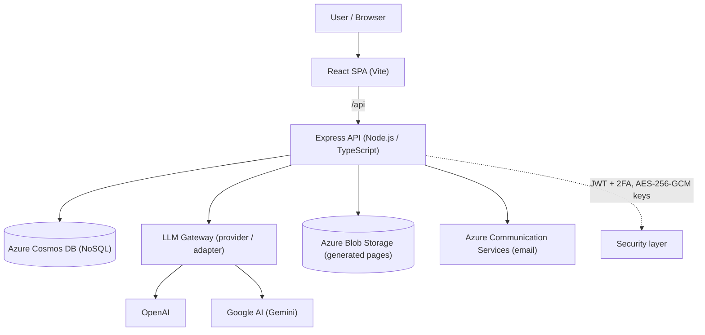

# XPIA Tools

**AI-Powered Security Research Toolkit for Cross-Prompt Injection Attack Testing**

XPIA Tools generates realistic documents, payloads, and web pages containing prompt-injection techniques — purpose-built for security researchers evaluating the resilience of AI/LLM systems.

> ⚠️ **Responsible use only.** This toolkit produces cross-prompt injection (XPIA) test
> artifacts for evaluating AI/LLM systems **you own or are explicitly authorized to test**.
> Do not target systems without authorization. See [SECURITY.md](./SECURITY.md).

[](./LICENSE)
[](https://github.com/skajake1983/xpia-tools-oss/actions/workflows/ci.yml)
[](https://nodejs.org)
[](https://www.typescriptlang.org/)
[](./CONTRIBUTING.md)

## Table of Contents

- [Features](#features)
- [Tech Stack](#tech-stack)
- [Project Structure](#project-structure)
- [Getting Started](#getting-started)
- [Testing](#testing)
- [CLI (datagen)](#cli-datagen)
- [Deployment](#deployment)
- [Fork and Self-Host](#fork-and-self-host)
- [Architecture](#architecture)
- [CosmosDB Containers](#cosmosdb-containers)
- [Security](#security)
- [Contributing](#contributing)
- [License](#license)
- [Acknowledgements](#acknowledgements)

## Features

- **Document Generation** — DOCX, PPTX, XLSX, PDF, HTML, CSV, Markdown, ICS, VCF, JSON, YAML, RTF, and QR codes with embedded XPIA techniques
- **Image Generation** — PNG, SVG, JPG, WebP, and GIF with 6 layout styles (dashboard, report, infographic, email preview, timeline, comparison), QR code support, and LLM-enhanced content
- **Payload Generation** — Targeted prompt-injection payloads across categories and severity levels with evasion modifiers (JSON/text output)
- **Web Page Hosting** — Generate and publish XPIA test pages to Azure Blob Storage with unique slugs
- **Multi-Provider LLM Gateway** — Pluggable adapter architecture supporting OpenAI and Google (Gemini) with per-user API key management
- **Prompt Templates** — Admin-managed system/user prompt customization per generation action
- **Admin Console** — User management, provider/model config, invite codes, usage metrics, prompt templates, and audit log
- **Platform Metrics** — All-time, monthly, and year-to-date tracking of tokens, documents, payloads, QR codes, web pages, and custom actions
- **Maintenance Mode** — Admin-controlled downtime page with custom messaging
- **Audit Log** — Immutable record of all admin actions with 90-day auto-retention via CosmosDB TTL
- **Security** — JWT + refresh tokens, 2FA (TOTP), rate limiting, AES-256-GCM key encryption, bcrypt passwords, email verification, Zod input validation

## Tech Stack

| Layer          | Technology                                         |
| -------------- | -------------------------------------------------- |
| **Server**     | Node.js 20, Express, TypeScript, Zod               |
| **Client**     | React 18, Vite, TypeScript                         |
| **Database**   | Azure Cosmos DB (NoSQL)                             |
| **Storage**    | Azure Blob Storage (static web pages)               |
| **Email**      | Azure Communication Services                        |
| **Infra**      | Bicep (IaC), Azure App Service (Linux, B1)          |
| **CI/CD**      | GitHub Actions — PR checks + tag-based releases     |
| **CDN/DNS**    | Cloudflare (proxy, SSL Full Strict)                 |
| **Testing**    | Vitest (500+ tests across server & client)           |

## Project Structure

```
├── client/                 # React SPA (Vite)
│   └── src/
│       ├── components/     # Shared UI components
│       ├── context/        # Auth & app context providers
│       ├── hooks/          # Custom React hooks
│       ├── lib/            # API client, utilities
│       └── pages/          # Route-level page components
├── server/                 # Express API server
│   └── src/
│       ├── config/         # App config & prompt definitions
│       ├── data/           # XPIA technique & payload definitions
│       ├── db/             # CosmosDB client, containers, repos, seeding
│       │   └── repositories/
│       │       ├── cosmos/ # CosmosDB implementations
│       │       └── mock/   # In-memory mocks for testing
│       ├── middleware/     # Auth, admin, rate limiting, maintenance, correlation ID
│       ├── routes/         # Express route handlers
│       └── services/       # Business logic & LLM adapters
│           └── llm/
│               └── adapters/ # OpenAI & Google adapters
├── shared/                 # Shared types between client & server
├── static-pages/           # Static HTML fallback pages (maintenance, etc.)
├── infra/                  # Bicep IaC modules
│   └── modules/            # App Service, Cosmos DB, Storage, Communication, Monitoring
├── .github/workflows/      # CI (ci.yml) and Release (release.yml)
└── scripts/                # Utility scripts
```

## Getting Started

### Prerequisites

- **Node.js** 20.x
- **Azure Cosmos DB** emulator (local dev) or an Azure Cosmos DB account
- **LLM API Keys** — at least one of: OpenAI API key, Google AI (Gemini) API key

### Installation

```bash
# Install all dependencies (root, server, client)
npm run install:all
```

### Environment Variables

Create `server/.env` for local development:

```env
# Required in production (auto-generated for local dev)
JWT_SECRET=<64-char-hex>
JWT_REFRESH_SECRET=<64-char-hex>
ENCRYPTION_KEY=<64-char-hex>

# Cosmos DB (defaults to local emulator)
COSMOS_ENDPOINT=https://localhost:8081
COSMOS_KEY=<emulator-key>
COSMOS_DATABASE=xpia-tools

# Optional
CLIENT_URL=http://localhost:5173
PORT=3001
PUBLIC_PAGES_DOMAIN=<your-pages-domain>
AZURE_STORAGE_CONNECTION_STRING=<blob-storage-connection-string>
AZURE_COMMUNICATION_CONNECTION_STRING=<email-connection-string>
EMAIL_SENDER_ADDRESS=<no-reply@yourdomain.com>
GITHUB_TOKEN=<pat-for-feedback-issues>
GITHUB_REPO=<owner/repo>
```

### Running Locally

```bash
# Start both server (port 3001) and client (port 5173) in dev mode
npm run dev
```

On first startup, the server seeds prompt templates and creates a bootstrap invite code (logged to console) if no users exist.

### First User Setup

1. Copy the bootstrap invite code from server logs
2. Navigate to http://localhost:5173/register
3. Register with the invite code
4. Verify email (or check server logs for the verification link in dev mode)
5. The first registered user is automatically granted admin role

## Testing

```bash
# Run all tests (server + client)
npm test

# Server tests only
cd server && npm test

# Client tests only
cd client && npm test

# Watch mode (server)
cd server && npx vitest
```

## CLI (datagen)

Prefer the terminal? The [`cli/`](./cli) package is a no-UI datagen tool that reuses the same
generation engine to produce documents, images, and payloads locally — no Azure required.

```bash
cd cli && npm install
npm run dev -- generate --type docx --technique di-ignore-previous --out ./out
npm run dev -- payloads --count 10 --format text
npm run dev -- list techniques
```

It also supports LLM-enhanced content against OpenAI-compatible endpoints (OpenAI, Azure AI
Foundry, Ollama, LM Studio, OpenRouter, xAI) and Google Gemini, with editable prompts.
See [cli/README.md](./cli/README.md).

## Deployment

### Infrastructure (Bicep)

```bash
# Copy the example parameters and fill in your values (app name, secrets, client URL)
cp infra/main.parameters.example.json infra/main.parameters.json

az deployment group create \
  --resource-group rg-xpia \
  --template-file infra/main.bicep \
  --parameters infra/main.parameters.json
```

### Configuring your public domain

The client's SEO tags read the site origin from `VITE_PUBLIC_SITE_URL` at build time
(see `client/.env.example`). Because they are served as static files, also edit
`client/public/robots.txt`, `client/public/sitemap.xml`, and the fallback pages in
`static-pages/` to point at your domain.

### CI/CD

- **Pull Requests → `main`**: the CI workflow (`.github/workflows/ci.yml`) runs the build and full test suite.
- **Tags `v*`**: the Release workflow (`.github/workflows/release.yml`) drafts GitHub release notes.

This repository does not include a deploy workflow. To automate deployment to your own
Azure App Service, add a workflow using your publish profile (stored as a repository secret
such as `AZURE_WEBAPP_PUBLISH_PROFILE`), or use the included `scripts/deploy-azure.ps1` helper.

## Fork and Self-Host

XPIA Tools is MIT-licensed — you are free to **fork it, modify it, self-host it, and even use
it commercially**. The only conditions are that you keep the MIT `LICENSE` (copyright notice)
in your copy and retain the third-party attributions in
[THIRD-PARTY-NOTICES.md](./THIRD-PARTY-NOTICES.md).

To stand up your own version:

1. **Fork** this repository (or click **Use this template** for a clean, standalone copy).
2. **Install & configure** — run `npm run install:all`, then copy `server/.env.example` →
   `server/.env` and `client/.env.example` → `client/.env` and fill in your own values.
3. **Rebrand freely** — the "Built by" credit in `client/src/pages/LandingPage.tsx` and the
   SEO metadata in `client/index.html` are just code; change them to your own name/brand.
4. **Set your domain** — `VITE_PUBLIC_SITE_URL`, plus `client/public/robots.txt`,
   `client/public/sitemap.xml`, and the pages in `static-pages/`.
5. **Deploy to your own Azure** — see [Deployment](#deployment). No access to the original
   author's infrastructure is required or granted.

You owe nothing back, though pull requests are always welcome.

## Architecture



<details>
<summary>ASCII diagram</summary>

```
┌─────────────┐     ┌──────────────┐     ┌─────────────────┐
│  React SPA  │────▶│  Express API │────▶│  Azure Cosmos DB │
│  (Vite)     │     │  (Node.js)   │     │  (NoSQL)         │
└─────────────┘     └──────┬───────┘     └─────────────────┘
                           │
                    ┌──────┴───────┐
                    │  LLM Gateway │
                    ├──────────────┤
                    │  OpenAI      │
                    │  Google AI   │
                    └──────────────┘
```

</details>

The LLM gateway uses a provider/adapter pattern. Each adapter normalizes request/response formats. User API keys are stored AES-256-GCM encrypted in Cosmos DB and decrypted per-request — the server never stores plaintext keys.

## CosmosDB Containers

| Container  | Partition Key | Purpose                                           |
| ---------- | ------------- | -------------------------------------------------- |
| `users`    | `/id`         | User profiles with embedded limits                 |
| `auth`     | `/userId`     | Tokens, sessions, trusted devices (TTL-enabled)    |
| `config`   | `/id`         | Providers, models, invites, prompts, audit log     |
| `api-keys` | `/userId`     | Encrypted API keys per user                        |
| `usage`    | `/userId`     | API call logs & token usage                        |
| `content`  | `/userId`     | Generated documents (base64)                       |
| `pages`    | `/userId`     | Generated web pages                                |

## Security

- **Authentication**: JWT access tokens (15 min) + HTTP-only refresh tokens (7 days)
- **2FA**: TOTP-based two-factor authentication
- **Password**: bcrypt with 12 rounds
- **API Keys**: AES-256-GCM encryption at rest, per-request decryption
- **Input Validation**: Zod schemas on every endpoint
- **Rate Limiting**: Per-IP and per-user rate limits on auth and generation endpoints
- **CORS**: Restricted to configured client URL
- **Helmet**: Security headers (CSP, HSTS, etc.)
- **Audit Trail**: All admin mutations logged with 90-day retention
- **Token Blocklist**: Revoked JWTs tracked with CosmosDB TTL auto-cleanup
- **Email Verification**: Required before account activation
- **Production Guards**: Server refuses to start without required secrets

## Contributing

Contributions are welcome! Please read [CONTRIBUTING.md](./CONTRIBUTING.md) and our
[Code of Conduct](./CODE_OF_CONDUCT.md). For security issues, see [SECURITY.md](./SECURITY.md).

## License

Licensed under the [MIT License](./LICENSE).

This project bundles and depends on third-party components under their own licenses
(including the LGPL-3.0 `libvips` library via `sharp`, and the SIL OFL-1.1 Inter font).
See [THIRD-PARTY-NOTICES.md](./THIRD-PARTY-NOTICES.md) for details.

## Acknowledgements

- Built by [Jacob Adams](https://www.linkedin.com/in/jacoblewisadams).
- Fonts: [Inter](https://github.com/rsms/inter) (SIL OFL-1.1).
- Image processing: [sharp](https://github.com/lovell/sharp) / [libvips](https://github.com/libvips/libvips).
- Built with React, Vite, Express, and the Azure SDKs.
